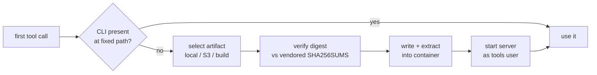
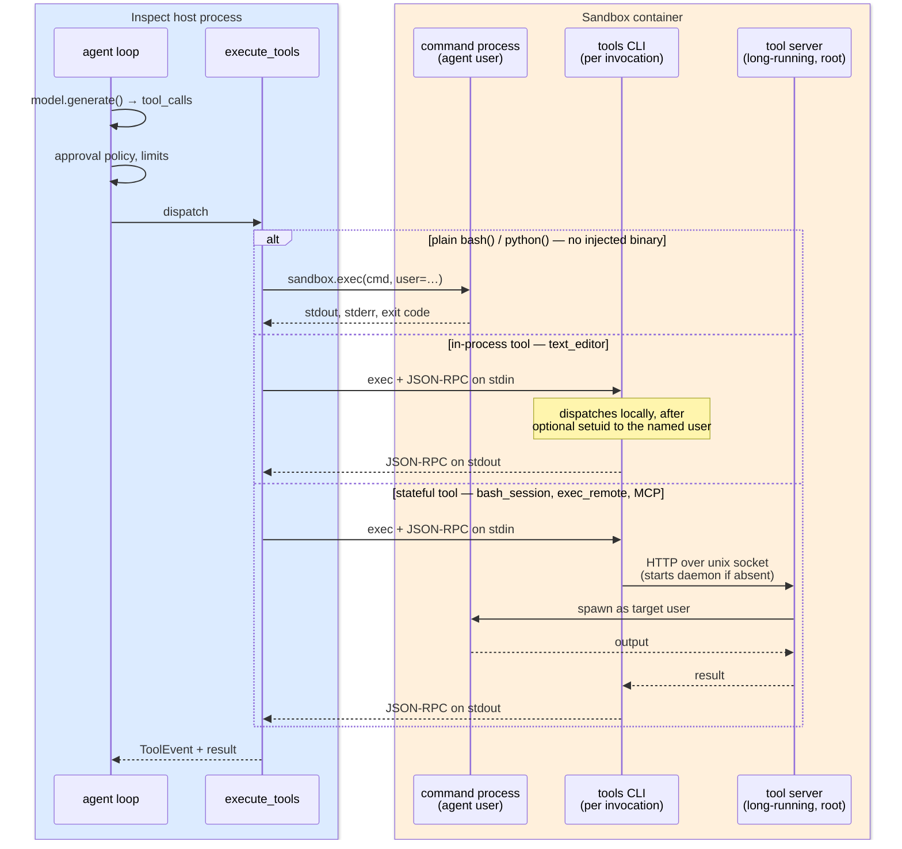
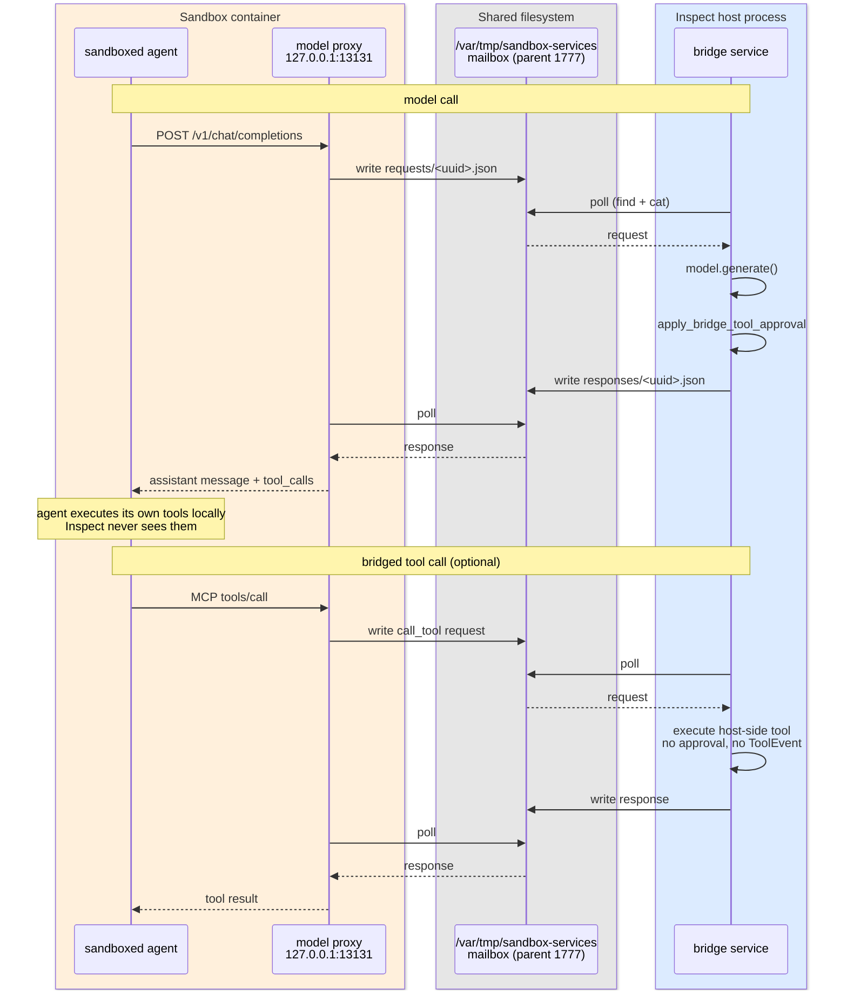

# Sandbox Architecture and Trust Model

## Scope

This document describes what runs where when Inspect evaluates a model against a
sandbox, which principals exist inside a container, and what the boundaries
between them are intended to guarantee. It then sets out the hardening required
to make those guarantees hold.

It is the container-internal counterpart to
[BINARY_INTEGRITY.md](../src/inspect_sandbox_tools/design/BINARY_INTEGRITY.md),
which covers the orthogonal supply-chain axis — whether the bytes injected into a
container are the bytes a maintainer blessed. That document's trust anchor is
merge rights; this one's is the container runtime. Neither subsumes the other.

Mechanical detail lives elsewhere and is not repeated here:
[AGENTS.md](../src/inspect_sandbox_tools/AGENTS.md) for the build and injection
mechanism, and [model-proxy-lifecycle.md](model-proxy-lifecycle.md) for the
bridge proxy's startup sequence.

> **Status: working draft.** The "Where the current design falls short" section
> and the findings map name unremediated weaknesses with file-level precision.
> Review for redaction before this document is published or upstreamed.

## Security invariant

**A principal's ability to reach a channel is not permission to use it.**

Inspect deliberately establishes a privilege boundary *inside* the sandbox
container: the evaluated agent is untrusted, and the tool server that serves it
is not. Every channel that crosses that boundary — the tool RPC socket, the
model proxy, the service mailbox — must therefore authenticate its caller and
authorize the specific operation requested. Filesystem permissions on a
well-known path control *reachability*; they are not a substitute for identity.

Two corollaries follow, and both are load-bearing:

- **A path is not a secret.** Container paths are enumerable — from the process
  table, from `/proc/net/unix`, and from this repository's own published source.
  No control may depend on an attacker failing to discover a location.
- **A privilege test is not an authorization test.** `os.getuid() == 0` answers a
  question about the server. It does not answer the question that matters, which
  is whether *this caller* may request *this action*.

## Current architecture

### Principals and privilege zones

A container running an eval holds at least two principals. When the sandbox
provides root, injection creates the tools tree as root and restricts it to mode
`0700`, so the evaluated agent can neither read nor execute the tooling that
serves it (`tool/_sandbox_tools_utils/sandbox.py:111-141`).

### Processes in a container

The injected executable is not one daemon; it is a multi-call binary
(`exec`, `start-server`, `server`, `stop-server`, `healthcheck`, `model_proxy` —
`_cli/main.py:372-378`) that yields distinct processes with different lifetimes:

| Process | Lifetime | Runs as | Serves |
|---|---|---|---|
| **Tools CLI** (`exec`) | One per host tool call | Started as `_tools_user` (root); may `setuid` down to `_run_as_user` for in-process tools | Executes *stateless* tools itself; otherwise acts as a client to the daemon |
| **Server daemon** (`start-server`) | Container lifetime | root, stays root | *Stateful* tools; switches user per job via `preexec_fn` |
| **Model proxy** (`model_proxy`) | Bridge session (Pattern 2 only) | Spawned by the daemon as an `exec_remote` job | Relays model calls from a sandboxed agent |
| **Command processes** | Per command | Agent user, or a user named by the caller | The actual work |

The CLI routes on a static list (`_cli/main.py:151-194`): if the requested
method is an in-process tool it dispatches locally, otherwise it calls
`_ensure_server_is_running()` and forwards over the socket.

| Kind | Tools | Executed by |
|---|---|---|
| In-process (stateless) | `text_editor`, `version` | The CLI process |
| Remote (stateful) | `bash_session`, `exec_remote`, `mcp` | The daemon |

Three consequences worth keeping in view:

- **The unix socket is a CLI→daemon channel**, not a host→container one. The
  host never speaks to the daemon directly; it always goes through a fresh CLI
  process. Neither endpoint is intended to be reachable by the agent.
- **Stateless tools run in the CLI, as root.** Defects in `text_editor` are
  root-privileged defects in a *short-lived* process, not in the daemon — the
  daemon's hardening does not cover them.
- **Both privileged processes create the runtime directory.** The CLI creates it
  first (`_cli/main.py:200-203`, before the daemon exists), and the daemon later
  applies the mode (`_cli/server.py:144-146`). This is the two-creation-site
  split that Hardening item 1 addresses; it exists because these are two
  genuinely different processes, not one.

Data returns along the channel it was requested on: the stdout of the `exec` the
host initiated. **On the tool-execution path the untrusted zone has no inbound
channel to the host** — it cannot initiate anything, only answer.

That property belongs to the tool path, not to Pattern 1 as a whole. Any
*sandbox service* creates a genuine inbound channel, and there are two:
`agent/_bridge/sandbox/service.py:74` (the bridge) and
`agent/_human/service.py:40` (the human agent). A container running the human
agent has an inbound channel regardless of which pattern drives the eval.

Note that plain `bash()`/`python()` (`tool/_tools/_execute.py:105`) go straight
to `sandbox.exec()` and never touch the injected binary or the tool server; only
stateful tools — `bash_session`, `text_editor`, sandbox MCP — use the daemon
(`tool/_tools/_bash_session.py:196-199`,
`tool/_tools/_text_editor.py:112-136`). This asymmetry has a security
consequence: an agent can run commands through the plain path *before* any
stateful tool has triggered injection, which is what makes the directories
described below pre-creatable.

The boundary exists only where the sandbox default user is *not* root. In a
container whose default user is root there is no in-container boundary at all,
and containment rests entirely on the container runtime.

`_tools_user` (`util/_sandbox/environment.py:137`) records which user won that
negotiation and is replayed as the `user=` of every subsequent tool exec.

### Delivery

The tools executable is not baked into an image; it is injected into a running
container at the first tool call.

Two properties matter for the threat model:

- Detection is by **file existence** at a fixed path
  (`sandbox_file_detector(SANDBOX_CLI)`, `sandbox.py:91`), so whatever occupies
  that path is adopted.
- Digest verification is **advisory by default**. Unless
  `INSPECT_SANDBOX_TOOLS_STRICT_DIGESTS` is set (`sandbox.py:355-362`), a
  mismatch warns and the unverified bytes are used (`sandbox.py:407-429`).
  Locally bundled binaries are never hashed at all.

Staging uses a fixed name in a world-writable sticky directory
(`{SANDBOX_TOOLS_DIR}.pkg.tgz`, `sandbox.py:178`), written by
`base64 -d | tee` (`util/_sandbox/docker/docker.py:476-488`), which follows
symlinks, and extracted with plain `tar xzf` — no `--no-same-owner`, no member
path validation.

### Pattern 1 — host-driven agent

The agent loop runs in the Inspect process. The model proposes tool calls;
Inspect approves, executes, and records them.

Direction is host → sandbox, synchronous, one exec per call
(`util/_sandbox/_json_rpc_transport.py:43`). Inspect sees every tool call and
can refuse it. Untrusted output crosses the boundary as the *response* to a
request the host made — a privileged process (the CLI, or the daemon behind it)
is a conduit for it, which is why content-handling defects in that path (and in the
transcript and display layers that consume it) are part of this boundary even
though they are not privilege escalations.

#### Tool user confinement

The user a tool runs as is **host-side configuration**, chosen by the eval
author when the tool is constructed — `bash(user=…)`, `text_editor(user=…)`,
`bash_session(user=…)` — and curried into the tool's closure. It is
deliberately absent from the model-facing schema: `bash()` advertises
`parameters={"command": …}` and nothing else
(`tool/_tools/_execute.py:94-121`). **The model chooses what to run, never as
whom**, and must not be able to change it.

The contract holds against the model itself. Host-side construction is
deliberately defensive: `text_editor` builds its RPC params by filtering
`locals()` to the signature of the model-facing `execute`, then adds
`_run_as_user` *afterwards* (`tool/_tools/_text_editor.py:118-127`), so a model
that tried to supply that key would have it dropped before the host set the real
one.

What the contract is not defended against is anything that does not arrive
through the host. Two defects:

- **The wire is unauthenticated.** Confinement binds only callers that come
  through the host; anything reaching the socket directly supplies its own
  user, and the tool's schema is irrelevant to it.
- **It fails open.** For in-process tools the CLI starts as root and drops
  privilege only `if run_as_user is not None` (`_cli/main.py:172-179`). An
  absent or stripped field means the tool runs as root — so this misfires on a
  legitimate call that merely omits the field, not only under attack.

**A maintenance hazard, not a current weakness.** The target user travels
in-band, as an ordinary field of the request — `SubmitParams.user`,
`params={"user": …}` (`tool/_tools/_bash_session.py:206`), or the reserved
`_run_as_user` key popped from the params dict (`_cli/main.py:166-179`) — so
control data and model arguments share one namespace. No attack follows from
this today, from any position: every `params` dict is built host-side from
literal keys, model-supplied content only ever appears nested inside a *value*
(as in MCP's `params={"session_id": …, "request": …}`), and an attacker who can
reach the socket composes the whole request regardless, making in-band versus
out-of-band irrelevant to them. It is recorded because the separation is
maintained independently at each call site rather than by the protocol: a future
tool that builds its params as `{**model_args}` would make it live, and nothing
would catch that.

These need separate fixes. Hardening item 2 removes the attack: once only the
host's root CLI can reach the socket, no unauthenticated caller can name its own
user. Fail-open is not covered by it and must be fixed on its own, because it
misfires on a legitimate call that simply omits the field — confinement should
fail closed: no named user, no privileged execution. Carrying the target user
outside the request body would retire the maintenance hazard as well, but that
is robustness work, not remediation, and should not be scheduled as though it
closed a hole.

### Pattern 2 — sandboxed agent via the bridge

The agent runs *inside* the container and calls a proxy that relays model
requests to the host. The bridge translates one request/response pair; it does
not dispatch tools.

Direction is sandbox → host, asynchronous, over a file mailbox. The same
injected executable hosts the proxy (`exec_remote([SANDBOX_CLI, "model_proxy"])`,
`agent/_bridge/sandbox/bridge.py:207-217`), but this is an entirely separate RPC
system from Pattern 1 — no shared transport, opposite direction.

### Where tool calls actually execute

This is the most frequently misunderstood part of the architecture.

| Tool kind | Executes | Inspect can refuse it? | Transcript |
|---|---|---|---|
| Pattern 1 tool | Container, via tool server | Yes — approval before dispatch | Full `ToolEvent` + `SandboxEvent` |
| Sandboxed agent's own tools | Container, by the agent itself | Only by refusing the *proposal* at generate | Proposals in `ModelEvent`; results only as the agent resends them |
| Provider-side tools (web search, code execution, remote MCP) | At the model provider | By withholding the tool — off by default for sandboxed agents (`sandbox/bridge.py:142-150`) | `ModelEvent` only |
| `bridged_tools` | **Inspect host process** (`sandbox/service.py:177-199`) | At the generate chokepoint | `ModelEvent`; no discrete tool event |

`_approval.py:3` states the model plainly: *"A bridged scaffold runs its own tool
loop, so Inspect never executes its tool calls and the `execute_tools()`
approval path never runs."* `ToolEvent` is constructed only in
`model/_call_tools.py`; nothing on the bridge path emits one.

The practical consequence: Pattern 2 gives model-level observability, not
tool-level observability. Timing, errors, and any call the scaffold does not
resend are lost. Evaluations that depend on tool-level auditing should use
Pattern 1.

## Threat model

### Trust anchors

| Anchor | Establishes |
|---|---|
| Container runtime isolation | The sandbox cannot reach the host kernel or filesystem |
| Merge rights to this repository | The tools binary is the one maintainers blessed (see BINARY_INTEGRITY.md) |
| Host process integrity | Approval policy, limits, and credentials are honest |

### Attacker positions

The evaluated model is the primary adversary; it is the principal the sandbox
exists to contain. We assume it can run arbitrary code as the sandbox default
user, read this repository, enumerate processes and sockets in the container,
and create files anywhere that user can write.

Two secondary positions matter. A **co-resident container process** may run as a
different uid than the agent — a deliberately deprivileged agent alongside a more
privileged default user, or a sidecar sharing the network namespace.
**Browsed web content** is attacker-influenced input rendered inside the
container, and can issue requests to container-local services.

### What the boundary must guarantee

There is not one boundary but three, and they do not apply uniformly across the
two patterns. Conflating them is the main reason "is this in scope?" is hard to
answer for a given defect.

| Boundary | What it separates | Present in |
|---|---|---|
| **A — In-container privilege** | agent user ↔ tools user | Both patterns, whenever tooling is injected |
| **B — Container → host capability** | container ↔ Inspect process | Wherever a sandbox service runs: the bridge, the human agent |
| **C — Mediation** | what the agent does ↔ what Inspect can refuse and record | Both, but with very different strength |

The guarantees:

1. The evaluated agent cannot execute code as the tools user. *(A)*
2. The evaluated agent cannot read, replace, or redirect the tools tree, the
   server runtime directory, or their contents. *(A)*
3. The evaluated agent cannot invoke host-side capability — tool execution,
   model generation with host credentials, answer submission — outside the paths
   Inspect mediates and can refuse. *(B)*
4. A tool call Inspect declines is not executed by any route. *(C)*
5. Nothing the agent controls can cause a privileged component to act on a path
   or identity of the agent's choosing. *(A and B)*
6. Untrusted output crossing the boundary cannot subvert the component that
   parses, records, or renders it. *(all)*

Two of these mean materially different things in each pattern:

**Guarantee 3 is not Pattern 2-specific.** The bridge is the largest inbound
surface, but the human agent exposes submission, scoring, and clock methods to
any process in the container over the same mailbox mechanism. An eval driven
entirely by Pattern 1 that uses the human agent still owes guarantee 3.

**Guarantee 4 is strong in Pattern 1 and weak in Pattern 2.** When Inspect
executes tools it can refuse absolutely: a declined call does not run. When the
agent runs its own loop in the container, Inspect can only decline to *return*
the proposal — nothing prevents the scaffold from acting on it, or from acting
without asking. Pattern 2 therefore substitutes containment for mediation, which
is why withholding provider-side tools and authenticating the proxy matter more
there than any approval policy does.

Boundary A, by contrast, is identical in both patterns: both inject the same
binary and run the same privileged processes.

### Explicitly out of scope

- **Container escape via the runtime or kernel.** Addressed by the choice of
  sandbox provider, not by this design. A microVM provider hardens this axis and
  addresses none of the guarantees above: boundary A is internal to the guest,
  and boundaries B and C are channels Inspect deliberately provides across the
  isolation layer, which a stronger isolation layer does not authenticate.
- **Containers whose default user is root.** No in-container boundary exists;
  guarantees 1 and 2 are vacuous.
- **Denial of service by the agent against its own tooling.** An agent can
  decline to cooperate regardless; self-inflicted unavailability is not a
  security boundary. Cross-principal DoS is in scope.
- **Supply chain.** See BINARY_INTEGRITY.md.
- **Host-side compromise.** An attacker who can write to `site-packages` can
  patch Inspect itself.

## Where the current design falls short

The guarantees above are presently enforced by convention rather than by
mechanism. Three assumptions recur across otherwise unrelated components,
because none was given a way to learn who is calling.

### 1. Location is treated as a secret

The tools tree (`util/_sandbox/_cli.py:25`) and the server runtime directory
(`_util/constants.py:11-16`) are compile-time constants, identical across every
run, sample, container, and installation. `_cli.py`'s own docstring concedes the
obscured name is anti-discovery — *"unlikely to be accidentally stumbled upon by
an LLM"* — not access control.

Both are created in world-writable parents with `mkdir(exist_ok=True)` and no
ownership check, so a directory the agent pre-created is adopted rather than
rejected (`_cli/server.py:144-146`, `_cli/main.py:200-203`). Applying `chmod
0700` to a directory another principal owns does not take it away from them —
the owner can restore access. The privileged CLI additionally opens lock and log
files inside that directory with symlink-following `open()`
(`_cli/main.py:227-229`) and reads back a `server.pid` it then acts on
(`_cli/main.py:326-343`).

The correct check exists twenty lines away: `_prepare_socket_parent()`
(`_cli/server.py:108-128`) does `lstat` + `S_ISDIR` + `st_uid != os.getuid()` —
and early-returns before applying it whenever `SOCKET_PATH.parent == SERVER_DIR`,
i.e. on every normal deployment.

### 2. The transport is treated as authorization

Both tool sockets are bound world-connectable by design — `umask(0o111)` yields
mode `0666` (`_cli/server.py:165-171`;
`inspect_tool_support/_cli/server.py:27-39`) — with the containing directory's
mode as the only gate. `handle_request` dispatches whatever arrives
(`_cli/server.py:154-161`). There is no peer-credential check in either package.

Session and job identifiers are guessable and unbound to a creating principal:
`f"{default_name}_{current_count}"` over fixed constants like `"BashSession"`
(`_util/session_controller.py:14-28`), and raw PIDs for `exec_remote`
(`_exec_remote/_controller.py:9-14`). `session_for_name` is a bare dict lookup,
so naming a session is sufficient to act on it — including one created as
another user.

The user-switching gate tests the *server*, not the caller:
`_can_switch_user = os.getuid() == 0` (`_exec_remote/json_rpc_methods.py:19`),
with the target user an ordinary wire parameter (`SubmitParams.user`,
`_exec_remote/tool_types.py:18-19`) passed to `preexec_fn=make_preexec(user)`
(`_job.py:74-101`). The effective rule is *"if this daemon is root, any socket
client may name any user, including root."*

The bridge proxy is unauthenticated on container loopback
(`_agent_bridge/proxy.py:52-58`, port 13131), which every process and uid in the
container shares, and serves `Access-Control-Allow-Origin: *`
(`proxy.py:197-205`) to browsed content. Its handlers call `os._exit(1)` on
error (`proxy.py:1417`, `:1639`). Its backing mailbox sits under a `1777` parent
(`util/_sandbox/service.py:29-30`).

Separately, `call_tool` (`agent/_bridge/sandbox/service.py:177-199`) is a second,
independently reachable route to host-side tool execution that does not pass
through the `bridge_generate` approval chokepoint (`agent/_bridge/util.py:341`)
and emits no tool event. The single-chokepoint design is sound only if the
chokepoint is the sole route.

### 3. Privileged components act on agent-influenced inputs

Path-based operations that follow symlinks, environment variables that redirect
privileged lookups (`XDG_RUNTIME_DIR`/`HOME` in
`inspect_tool_support/_util/constants.py:9-15`), shell strings built from
attacker-influenced paths (`_text_editor/text_editor.py:27-34` interpolating
into `create_subprocess_shell`), and serialized formats permitting code
execution all let the agent choose what a privileged component acts upon.

### The mechanisms already exist here

The gap is not that these controls are unknown in this codebase:

| Control | Implemented at | Not applied at |
|---|---|---|
| Peer-UID enforcement | `_util/sockets.py:69` (`peer_uid`), `_control/server.py:266-307` | Either sandbox-tools socket — zero uses |
| fd-based dir creation (`O_NOFOLLOW` + `fstat` + `fchmod`) | `_util/json_rpc_chunking.py:41-108` | `SERVER_DIR` in `_cli/server.py:145`, `_cli/main.py:202` |
| Per-sample private tools dir | `util/_sandbox/local.py:90-99` | Docker — `INSPECT_SANDBOX_TOOLS_DIR` never set |
| `st_uid` ownership verification | `_cli/server.py:123` | The primary socket directory (early return at `:110`) |

What is missing is a single enforced contract, which is what this document is
intended to become.

## Proposed hardening

Ordered by leverage. The first two are independent and both are required:
verified directories control *reachability*, peer authentication controls
*identity*. Neither substitutes for the other, because a correctly permissioned
directory still hands out privileged operations to anything that obtains a
descriptor on the socket.

### 1. One verified-directory helper, used everywhere

Every site that creates or opens a privileged directory routes through a single
helper that opens with `O_NOFOLLOW`, verifies ownership and type on the
descriptor with `fstat`, applies the mode with `fchmod`, and **safely recreates**
rather than adopting a directory that fails the check. This is the discipline
`json_rpc_chunking.py` already implements.

Recreating rather than refusing matters: refusing to start converts a squatted
directory into an availability failure, while safe recreation removes the
attacker's position and continues. Applies to `SERVER_DIR` at both creation
sites, the tools tree, the staging path, and the equivalent directories in
`agent/_human/install.py`. Root-side reads that validate by path and then reopen
by path (`json_rpc_chunking.py:200-218`) resolve once and read from the verified
descriptor.

A mechanical test should assert no other site creates these directories, so the
next component cannot reintroduce the pattern.

This is stateless: no bookkeeping, works when reconnecting to a pre-existing
container, and cannot be defeated by discovery.

### 2. Peer-credential authentication on both tool sockets

The server drops connections whose peer UID is not the tools user, before
parsing a request, reusing `peer_uid` and the protocol-level integration already
proven in `_control/server.py`.

This is the control that actually addresses discovery — it does not matter that
the agent can enumerate the socket path from `/proc/net/unix`. It renders
`_can_switch_user` moot as an escalation vector: that flag remains a privilege
test, but the question it was standing in for — *may this caller switch user?* —
is now answered at the connection, before any request is parsed. It is also the
only control that helps wherever the daemon runs non-root but the agent runs as
a different uid, since there the runtime directory is deliberately `0777` and
ownership confers no protection at all.

Note what this does *not* require, and what it does not fix. It does not require
an allow-list of permissible target users: once the only authenticated caller is
the host's own root CLI, naming a user over the socket is not an escalation,
because a caller that passes the peer check is already root and could `setuid`
without asking. That would only become a real constraint if authenticated
callers were ever widened below root — for example if the CLI dropped privilege
before forwarding, making "caller uid X may request only user X" meaningful.

Nor does it fix the fail-open default in tool user confinement, which misfires
on legitimate calls rather than under attack and needs its own fix.

### 3. Unpredictable, owner-bound session and job handles

Replace sequential session names and raw PIDs with `secrets.token_hex()` handles
recorded against the creating principal and checked on every operation.

**Exploitable today.** Before item 2 lands, any container process that reaches
the socket can name `BashSession` or `WebBrowser` — the namespace is fully
enumerable — and act on a session it did not create. `session_for_name` is a
bare dict lookup, so naming is sufficient. Concretely: the model's browser
session carries live authenticated cookies, and an attaching process can read
rendered pages and issue state-changing requests under that identity; a bash
session created with `user=` yields a shell as that user; and for `exec_remote`,
a guessed PID accepts `exec_remote_write_stdin`, injecting input into a
root-owned job.

**Where it remains load-bearing after item 2.** Under a single-uid peer check
this becomes defense in depth — the agent cannot connect at all. But a
single-uid check is not available everywhere: `inspect_tool_support` binds its
`0666` socket *deliberately* to admit several principals, enumerating them in
the source — "root creates socket, non-root clients connect later; non-root
creates socket, root connects later; non-root1 creates socket, non-root2
connects later" (`inspect_tool_support/_cli/server.py:27-39`) — and the
sandbox-tools server likewise uses mode `0o777` when non-root. In those
configurations peer authentication can establish *which* uid is calling but
cannot stop uid A from naming uid B's session, because the handle carries no
owner. **This is the configuration that justifies item 3 independently rather
than as redundancy.**

### 3a. `Job.kill()` process-state guard — a correctness fix

Distinct from the above, and not a security fix. `kill()` gates on
`self._state != "running"`, but `_state` only advances to `"completed"` inside
`poll()` (`_exec_remote/_job.py:185-208`). A caller that submits a job and kills
it without polling can therefore reach `os.killpg()` after asyncio has already
reaped the child — as root, against a possibly recycled process group.
`ProcessLookupError` is caught, but a *recycled* pgid raises nothing; it signals
a live, unrelated group. This misfires for a legitimate caller with no attacker
present, so it belongs with the fail-open default rather than with
authorization.

### 4. Bridge: authenticate the proxy and close the second entry point

The model proxy issues a per-run bearer token, delivered by the same mechanism
that already carries its base URL. CORS is disabled or restricted to an explicit
allowlist. Handler failures return 5xx rather than `os._exit(1)`. Mailbox files
are created with restrictive modes and `O_EXCL`/`O_NOFOLLOW`.

Separately, `call_tool` must pass through the same approval chain as any other
tool call and emit a `ToolEvent`. This preserves the single-chokepoint design
rather than replacing it, and closes the observability gap noted above.

### 5. Verify what runs as root

`INSPECT_SANDBOX_TOOLS_STRICT_DIGESTS` becomes enforcing by default, since the
artifact is executed as the tools user. Privileged components stop consuming
serialized formats that permit code execution, and stop constructing shell
command strings from paths — an argument vector
(`create_subprocess_exec(["find", path, ...])`) removes the injection class
rather than escaping it.

### Considered and rejected: randomizing paths

Randomizing the tools tree and runtime directory per run closes the window in
which an agent can pre-create them. Rejected as a primary control:

- **No confidentiality.** Bound socket paths are enumerable from
  `/proc/net/unix`, and the tools path appears in the argument vector of every
  `docker exec`, so a random path is discoverable within one tool call. It buys
  anti-squatting only — which item 1 also buys, statelessly.
- **Real tracking cost.** `SERVER_DIR` is resolved at import time from an
  environment variable (`_util/constants.py:11-16`), so the value must be
  generated once and replayed on every subsequent invocation for the life of the
  container, and rediscovered when attaching to a pre-existing container.
- **Potentially self-defeating.** A directory exceeding
  `_MAX_UNIX_SOCKET_PATH_BYTES` (100) falls back to
  `/tmp/inspect-sandbox-tools-{uid}/{hash}.sock` (`_util/constants.py:22-31`) — a
  *fixed* path, reintroducing the problem it was meant to solve.

Worth adding later as defense in depth; not a substitute for item 1.

### Considered: removing the in-container privilege split

The largest available reduction in attack surface is to stop running a
privileged daemon alongside an untrusted agent — one disposable container per
sample, agent as root, nothing to escalate to. Most concerns in this document
become vacuous rather than defended.

This is a product decision, not solely a security one: evaluations that hide
root-owned scoring assets from the agent, or that need the agent deliberately
deprivileged, depend on the split existing. Recorded here so the choice is made
deliberately rather than by default.

## Findings map

Scan findings tracked as draft issues on the security board, mapped to the
hardening items above. Identifiers are Claude Security finding ids.

| Finding | Summary | Item |
|---|---|---|
| 3672032 | Pre-occupied server dir reaches root RPC server | 1, 2 |
| 3672959 | Pre-created tools dir swaps root-executed launcher | 1 |
| 3672960 | Archive staged unprivileged, extracted by root | 1, 5 |
| 3672962 | Agent-created file at CLI path spoofs injection detector | 1 |
| 3672970 | Root tool deserializes attacker-plantable pickle | 1, 5 |
| 3673732 | CLI trusts agent-writable pid/lock/status files | 1 |
| 3673733 | Symlink race in per-uid chunk dirs | 1 |
| 3673720 | Human-agent installer stages in preparable directory | 1 |
| 3672040 | Non-root server exposes exec RPC to every container user | 2 |
| 3673753 | Tool server binds world-connectable socket | 1, 2 |
| 3673741 | Predictable session names permit session hijack | 3 |
| 3672038 | PID-reuse race in root `killpg` | 3a |
| 3672977 | Unauthenticated loopback model proxy | 4 |
| 3672978 | Bridge mailbox world-readable to container uids | 4 |
| 3672035 | Bridge `call_tool` bypasses approval enforcement | 4 |
| 3672961 | Digest mismatch only warns; unverified binary run as root | 5 |
| 3672973 | Command injection via unquoted path in shell string | 5 |

## Adopting this document

The value of writing the boundary down is that new components can be checked
against it. A component that crosses the agent/tools boundary should be able to
state which principal may call it, how that principal is authenticated, and
which boundary it sits on, and which of the six guarantees it upholds. Where the answer is "the caller is
whoever reached the socket," the component is not finished.
