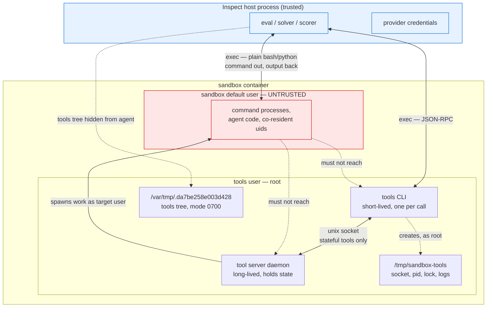
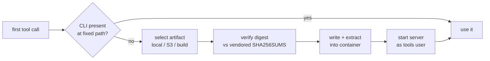
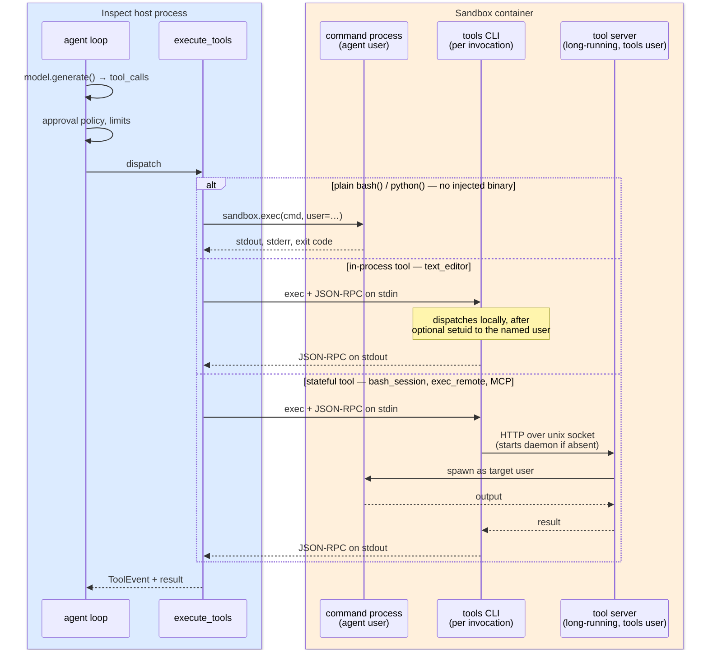
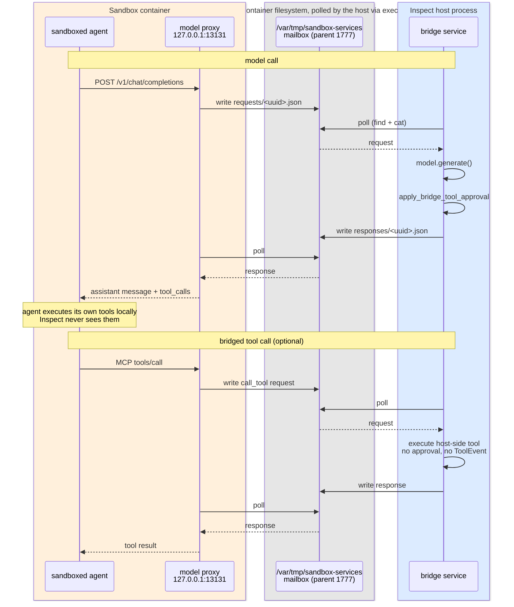

# Sandbox Architecture and Trust Model

## Scope

This document describes what runs where when Inspect evaluates a model against a
sandbox, which principals exist inside a container, and what the boundaries
between them are intended to guarantee. It then sets out the hardening required
to make those guarantees hold.

It is the container-internal counterpart to
[BINARY_INTEGRITY.md](../src/inspect_sandbox_tools/design/BINARY_INTEGRITY.md),
which covers the orthogonal supply-chain axis — whether the bytes injected into a
container are the bytes a maintainer blessed. That document's trust anchor is
merge rights; this one's is the container runtime. Neither subsumes the other.

Mechanical detail lives elsewhere and is not repeated here:
[AGENTS.md](../src/inspect_sandbox_tools/AGENTS.md) for the build and injection
mechanism, and [model-proxy-lifecycle.md](model-proxy-lifecycle.md) for the
bridge proxy's startup sequence.

> **Status: working draft.** The "Where the current design falls short" section
> and the findings map name unremediated weaknesses with file-level precision.
> Review for redaction before this document is published or upstreamed.

## Security invariant

**A principal's ability to reach a channel is not permission to use it.**

Inspect establishes a privilege boundary *inside* the sandbox only when the
tools processes and the evaluated agent actually run under different UIDs. The
evaluated agent is untrusted; where that split exists, the tool server that
serves it is a separate trusted principal. Sandbox services independently
establish a container-to-host boundary whether or not the UID split exists.
Every channel crossing either boundary — the tool RPC socket, the model proxy,
the service mailbox — must authenticate its caller and authorize the specific
operation requested. Filesystem permissions on a well-known path control
*reachability* only between different principals; they are not a substitute for
identity.

Two corollaries follow, and both are load-bearing:

- **A path is not a secret.** Container paths are enumerable — from the process
  table, from `/proc/net/unix`, and from this repository's own published source.
  No control may depend on an attacker failing to discover a location.
- **A privilege test is not an authorization test.** `os.getuid() == 0` answers a
  question about the server. It does not answer the question that matters, which
  is whether *this caller* may request *this action*.

## Current architecture

### Principals and privilege zones

The number of in-container principals is a runtime property, not a constant.
The diagram below depicts the two-principal configuration: the sandbox's
default user is non-root and injection can execute as root. Injection then
creates the tools tree as root and restricts it to mode `0700`, so the evaluated
agent can neither read nor execute the tooling that serves it
(`tool/_sandbox_tools_utils/sandbox.py:111-141`).



The other configurations collapse those two zones:

| Configuration | Agent and plain commands | `_tools_user` and tools processes | Boundary A |
|---|---|---|---|
| Root exec succeeds; default user is root | root | `"root"` / root | Absent — same UID |
| Root exec succeeds; default user is non-root | default non-root UID | `"root"` / root | **Present** |
| Root exec is unavailable; any default UID | default UID | `None` / default UID | Absent — same UID |

`_tools_user` starts as `None` (`util/_sandbox/environment.py:137`) and is set to
`"root"` only when the root directory probe succeeds. On fallback, injection,
the CLI, and the daemon all run as the sandbox default UID. Mode `0700` cannot
separate processes sharing that UID. Boundary A therefore requires both a
non-root default user *and* successful root execution; either fact alone is
insufficient. Collapsing Boundary A does not collapse Boundaries B or C; their
independent presence conditions below are unchanged.

### Processes in a container

The injected executable is not one daemon; it is a multi-call binary
(`exec`, `start-server`, `server`, `stop-server`, `healthcheck`, `model_proxy` —
`_cli/main.py:372-378`) that yields distinct processes with different lifetimes:

| Process | Lifetime | Runs as | Serves |
|---|---|---|---|
| **Tools CLI** (`exec`) | One per host tool call | `_tools_user`: root after a successful root probe, otherwise the default UID; may `setuid` only when root | Executes *stateless* tools itself; otherwise acts as a client to the daemon |
| **Server daemon** (`start-server`) | Container lifetime | `_tools_user`; switches user per job only when root | *Stateful* tools |
| **Model proxy** (`model_proxy`) | Bridge session (Pattern 2 only) | Inherits the daemon because its `exec_remote` job has no `user`; root only when the daemon is root | Relays model calls from a sandboxed agent |
| **Command processes** | Per command | Agent user, or a user named by the caller | The actual work |

The CLI routes on a static list (`_cli/main.py:151-194`): if the requested
method is an in-process tool it dispatches locally, otherwise it calls
`_ensure_server_is_running()` and forwards over the socket.

| Kind | Tools | Executed by |
|---|---|---|
| In-process (stateless) | `text_editor`, `version` | The CLI process |
| Remote (stateful) | `bash_session`, `exec_remote`, `mcp` | The daemon |

Three consequences worth keeping in view:

- **The unix socket is a CLI→daemon channel**, not a host→container one. The
  host never speaks to the daemon directly; it always goes through a fresh CLI
  process. Neither endpoint is intended to be reachable by the agent, although
  UID permissions cannot enforce that in a single-principal container.
- **Stateless tools run in the CLI, as the tools user.** In the two-principal
  configuration, defects in `text_editor` are root-privileged defects in a
  *short-lived* process, not in the daemon — daemon hardening does not cover
  them. In rootless fallback they run as the default UID instead.
- **Both tools processes create the runtime directory.** The CLI creates it
  first (`_cli/main.py:200-203`, before the daemon exists), and the daemon later
  applies the mode (`_cli/server.py:144-146`). Both are privileged in the
  two-principal configuration. This is the two-creation-site split that
  Hardening item 1 addresses; it exists because these are two genuinely
  different processes, not one.

Data returns along the channel it was requested on: the stdout of the `exec` the
host initiated. **On the tool-execution path the untrusted zone has no inbound
channel to the host** — it cannot initiate anything, only answer.

That property belongs to the tool path, not to Pattern 1 as a whole. Any
*sandbox service* creates a genuine inbound channel, and there are two:
`agent/_bridge/sandbox/service.py:74` (the bridge) and
`agent/_human/service.py:40` (the human agent). A container running the human
agent has an inbound channel regardless of which pattern drives the eval.

Note that plain `bash()`/`python()` (`tool/_tools/_execute.py:105`) go straight
to `sandbox.exec()` and never touch the injected binary or the tool server.
`bash_session`, `text_editor`, and sandbox MCP all use the injected tooling, but
only the stateful `bash_session` and MCP paths traverse the daemon;
`text_editor` dispatches locally in the short-lived CLI (`_cli/main.py:151-194`,
`tool/_tools/_text_editor.py:112-136`). This asymmetry has a security
consequence: an agent can run commands through the plain path *before* any
injected tool has triggered injection, which is what makes the directories
described below pre-creatable.

`_tools_user` records the result of the root probe and is replayed as the
`user=` of every subsequent tool exec. `None` deliberately means "use the
sandbox default user"; it does not name a separate rootless tools principal.

### Delivery

The tools executable is not baked into an image; it is injected into a running
container at the first tool call.



Two properties matter for the threat model:

- Detection is by **file existence** at a fixed path
  (`sandbox_file_detector(SANDBOX_CLI)`, `sandbox.py:91`), so whatever occupies
  that path is adopted.
- Digest verification is **advisory by default**. Unless
  `INSPECT_SANDBOX_TOOLS_STRICT_DIGESTS` is set (`sandbox.py:355-362`), a
  mismatch warns and the unverified bytes are used (`sandbox.py:407-429`).
  Locally bundled binaries are never hashed at all.

Staging uses a fixed name in a world-writable sticky directory
(`{SANDBOX_TOOLS_DIR}.pkg.tgz`, `sandbox.py:178`), written by
`base64 -d | tee` (`util/_sandbox/docker/docker.py:476-488`), which follows
symlinks, and extracted with plain `tar xzf` — no `--no-same-owner`, no member
path validation.

### Pattern 1 — host-driven agent

The agent loop runs in the Inspect process. The model proposes tool calls;
Inspect approves, executes, and records them.



Direction is host → sandbox, synchronous, one exec per call
(`util/_sandbox/_json_rpc_transport.py:43`). Inspect sees every tool call and
can refuse it. Untrusted output crosses the boundary as the *response* to a
request the host made — a tools process (privileged in the two-principal
configuration) is a conduit for it, which is why content-handling defects in
that path, and in the transcript and display layers that consume it, are part of
this boundary even when they are not privilege escalations.

#### Tool user confinement

The user a tool runs as is **host-side configuration**, chosen by the eval
author when the tool is constructed — `bash(user=…)`, `text_editor(user=…)`,
`bash_session(user=…)` — and curried into the tool's closure. It is
deliberately absent from the model-facing schema: `bash()` advertises
`parameters={"command": …}` and nothing else
(`tool/_tools/_execute.py:94-121`). **The model chooses what to run, never as
whom**, and must not be able to change it.

For example, an eval author who wants a bash session confined to the `nobody`
user configures it when constructing the tool:

```python
use_tools([bash_session(user="nobody")])
```

Omitting `user` does **not** currently mean the sandbox's default user for
injected tools. In a root-capable sandbox, `bash_session()` submits no target
user and its shell therefore inherits the root daemon's identity;
`text_editor()` supplies no `_run_as_user` field and therefore remains in the
root CLI process. The corresponding defaults grant the model root-authority
tool operations. An eval that intends to preserve the agent/tools privilege
split must explicitly name a non-root user for these tools. Plain `bash()` and
`python()` are different: their omitted `user` is passed directly to
`sandbox.exec()` and therefore selects the sandbox's default user.

The contract holds against the model itself. Host-side construction is
deliberately defensive: `text_editor` builds its RPC params by filtering
`locals()` to the signature of the model-facing `execute`, then adds
`_run_as_user` *afterwards* (`tool/_tools/_text_editor.py:118-127`), so a model
that tried to supply that key would have it dropped before the host set the real
one.

What the contract is not defended against is anything that does not arrive
through the host. Two defects:

- **The wire is unauthenticated.** Confinement binds only callers that come
  through the host; anything reaching the socket directly supplies its own
  user, and the tool's schema is irrelevant to it. This becomes cross-UID
  escalation only when the daemon is root; in rootless fallback, user switching
  is disabled but host mediation is still bypassed.
- **It fails open in the two-principal configuration.** For in-process tools the
  CLI starts as root and drops privilege only `if run_as_user is not None`
  (`_cli/main.py:172-179`). An absent or stripped field means the tool runs as
  root — so this misfires on a legitimate call that merely omits the field, not
  only under attack.

**A maintenance hazard, not a current weakness.** The target user travels
in-band, as an ordinary field of the request — `SubmitParams.user`,
`params={"user": …}` (`tool/_tools/_bash_session.py:206`), or the reserved
`_run_as_user` key popped from the params dict (`_cli/main.py:166-179`) — so
control data and model arguments share one namespace. No attack follows from
this today, from any position: every `params` dict is built host-side from
literal keys, model-supplied content only ever appears nested inside a *value*
(as in MCP's `params={"session_id": …, "request": …}`), and an attacker who can
reach the socket composes the whole request regardless, making in-band versus
out-of-band irrelevant to them. It is recorded because the separation is
maintained independently at each call site rather than by the protocol: a future
tool that builds its params as `{**model_args}` would make it live, and nothing
would catch that.

These need separate fixes. In the two-principal configuration, Hardening item 3
removes the attack: once only the host's root CLI can reach the socket, no
unauthenticated caller can name its own user. It cannot make that claim in a
single-principal container, where the agent shares the CLI's UID. Fail-open is
not covered by it and must be fixed on its own, because it misfires on a
legitimate call that simply omits the field — confinement should fail closed:
no named user, no privileged execution. Carrying the target user outside the
request body would retire the maintenance hazard as well, but that is robustness
work, not remediation, and should not be scheduled as though it closed a hole.

### Pattern 2 — sandboxed agent via the bridge

The agent runs *inside* the container and calls a proxy that relays model
requests to the host. The bridge translates one request/response pair; it does
not dispatch tools.



Direction is sandbox → host, asynchronous, over a file mailbox. The same
injected executable hosts the proxy (`exec_remote([SANDBOX_CLI, "model_proxy"])`,
`agent/_bridge/sandbox/bridge.py:207-217`), but this is an entirely separate RPC
system from Pattern 1 — no shared transport, opposite direction.

**What Pattern 2 uses the tools tree for.** Not the agent's tools: those the
agent executes itself, in-container, without the CLI or the daemon. The tree is
used to stand up the bridge. `sandbox_agent_bridge()` calls
`sandbox_with_injected_tools()` (`sandbox/bridge.py:140`), and the proxy is
started as an `exec_remote` job — so the injected binary *is* the proxy program,
and because `exec_remote` is a stateful tool, that one launch traverses the
whole Pattern 1 stack: host → CLI (tools user) → daemon (tools user) → proxy.
After startup the agent talks only to the proxy over loopback and never reaches
the CLI or daemon again through the intended path.

One consequence is easy to miss. The bridge sets `concurrency`, `env`, and
`poll_timeout` but not `options.user`, and the target user is forwarded only
`if self._options.user` (`util/_sandbox/exec_remote.py:320-321`). The job
therefore inherits the daemon's identity. **The model proxy runs as root only
when the tools daemon does**; under rootless fallback it runs as the same
default UID as the agent. In either case it is the unauthenticated loopback
listener described below.

**What that does and does not grant.** In a root-capable configuration it does
not by itself give a container process root: the proxy exposes model relay and
bridged-tool invocation, and neither runs a command in the container. Its root
identity is a blast-radius and least-privilege problem — a file-handling defect
in a handler would be root-privileged and its mailbox files are root-owned. In
rootless fallback there is no root uplift, but the unauthenticated host
capability remains.

The escalation the bridge actually grants is **to host-side capability rather
than to container root**: any container process can reach the proxy and invoke
`call_tool`, executing a bridged tool inside the Inspect process, outside the
container boundary, without passing the approval chokepoint. A route to
container root exists only by configuration — `bridged_tools` accepts any
`Tool`, so an author who bridges one that executes in the sandbox as a
privileged user hands that to an unauthenticated caller. The bridge does not
create the privilege; it removes the authentication and the approval gate in
front of whatever was bridged.

### Where tool calls actually execute

This is the most frequently misunderstood part of the architecture.

| Tool kind | Executes | Inspect can refuse it? | Transcript |
|---|---|---|---|
| Pattern 1 tool | Container, via tool server | Yes — approval before dispatch | Full `ToolEvent` + `SandboxEvent` |
| Sandboxed agent's own tools | Container, by the agent itself | Only by refusing the *proposal* at generate | Proposals in `ModelEvent`; results only as the agent resends them |
| Provider-side tools (web search, code execution, remote MCP) | At the model provider | By withholding the tool — off by default for sandboxed agents (`sandbox/bridge.py:142-150`) | `ModelEvent` only |
| `bridged_tools` | **Inspect host process** (`sandbox/service.py:177-199`) | At the generate chokepoint | `ModelEvent`; no discrete tool event |

`_approval.py:3` states the model plainly: *"A bridged scaffold runs its own tool
loop, so Inspect never executes its tool calls and the `execute_tools()`
approval path never runs."* `ToolEvent` is constructed only in
`model/_call_tools.py`; nothing on the bridge path emits one.

The practical consequence: Pattern 2 gives model-level observability, not
tool-level observability. Timing, errors, and any call the scaffold does not
resend are lost. Evaluations that depend on tool-level auditing should use
Pattern 1.

## Threat model

### Trust anchors

| Anchor | Establishes |
|---|---|
| Container runtime isolation | The sandbox cannot reach the host kernel or filesystem |
| Merge rights to this repository | The tools binary is the one maintainers blessed (see BINARY_INTEGRITY.md) |
| Host process integrity | Approval policy, limits, and credentials are honest |

### Attacker positions

The evaluated model is the primary adversary; it is the principal the sandbox
exists to contain. We assume it can run arbitrary code as the sandbox default
user, read this repository, enumerate processes and sockets in the container,
and create files anywhere that user can write.

Four secondary positions matter:

- A **co-resident container process** may run as a different uid than the agent
  — a deliberately deprivileged agent alongside a more privileged default user,
  or a sidecar sharing the network namespace.
- **Browsed web content** is attacker-influenced input rendered inside the
  container, and can issue requests to container-local services.
- In a human-agent eval, **task software shares the interactive user's UID**. It
  can invoke the same mailbox service as the human-facing CLI; peer UID and a
  token stored in that user's arguments, environment, or files cannot prove
  that a request expresses human intent.
- **Persisted or configured path data** — notably Skill supporting-file keys,
  session-log entries, and checkpoint contents — may later be consumed by a
  more privileged process. It remains untrusted even when it arrives through a
  nominally trusted host API.

### What the boundary must guarantee

There is not one boundary but three, and they do not apply uniformly across the
two patterns. Conflating them is the main reason "is this in scope?" is hard to
answer for a given defect.

| Boundary | What it separates | Present in |
|---|---|---|
| **A — In-container privilege** | agent user ↔ tools user | Both patterns, only when the default user is non-root and root exec succeeds |
| **B — Container → host capability** | container ↔ Inspect process | Wherever a sandbox service runs: the bridge, the human agent |
| **C — Mediation** | what the agent does ↔ what Inspect can refuse and record | Both, but with very different strength |

The guarantees:

1. Unless the eval author grants a model-facing tool the tools user's authority,
   the evaluated agent cannot execute code as the tools user. In the current
   implementation, omitting `user` from `bash_session()` or `text_editor()` in a
   root-capable sandbox constitutes such a grant; a hardened API should make
   that grant explicit rather than deriving it from an omitted field. *(A)*
2. The evaluated agent cannot read, replace, or redirect the tools tree, the
   server runtime directory, or their contents. *(A)*
3. The evaluated agent cannot invoke host-side capability — tool execution,
   model generation with host credentials, answer submission — outside the paths
   Inspect mediates and can refuse. *(B)*
4. A tool call Inspect declines is not executed by any route. *(C)*
5. Nothing the agent controls can cause a privileged component to act on a path
   or identity of the agent's choosing. *(A and B)*
6. Untrusted output crossing the boundary cannot subvert the component that
   parses, records, or renders it. *(all)*

Two of these mean materially different things in each pattern:

**Guarantee 3 is not Pattern 2-specific.** The bridge is the largest inbound
surface, but the human agent exposes submission, scoring, and clock methods to
any process in the container over the same mailbox mechanism. An eval driven
entirely by Pattern 1 that uses the human agent still owes guarantee 3.

Human intent is not presently a separate operating-system principal. The human
and arbitrary task code normally share a UID, so authenticating a mailbox
request as that UID establishes possession, not authorship by the human. A
state transition that specifically requires human intent therefore needs
host-side confirmation or a separately protected principal; moving a bearer
token among same-UID-readable channels does not create that distinction.

**Guarantee 4 is strong in Pattern 1 and weak in Pattern 2.** When Inspect
executes tools it can refuse absolutely: a declined call does not run. When the
agent runs its own loop in the container, Inspect can only decline to *return*
the proposal — nothing prevents the scaffold from acting on it, or from acting
without asking. Pattern 2 therefore substitutes containment for mediation, which
is why withholding provider-side tools and authenticating the proxy matter more
there than any approval policy does.

Boundary A, by contrast, has the same presence condition in both patterns: both
inject the same binary, and both obtain a distinct privileged tools principal
only when the root probe succeeds while the default user is non-root.

### Explicitly out of scope

- **Container escape via the runtime or kernel.** Addressed by the choice of
  sandbox provider, not by this design. A microVM provider hardens this axis and
  addresses none of the guarantees above: boundary A is internal to the guest,
  and boundaries B and C are channels Inspect deliberately provides across the
  isolation layer, which a stronger isolation layer does not authenticate.
- **Single-principal containers, for Boundary A.** No agent↔tools privilege
  boundary exists when the sandbox default user is root or when root exec is
  unavailable. Guarantees 1 and 2 are not supplied there, and escalation across
  Boundary A is vacuous. Boundaries B and C remain in scope: sharing a UID does
  not authorize the container to invoke host capabilities or bypass mediation.
- **Denial of service by the agent against its own tooling.** An agent can
  decline to cooperate regardless; self-inflicted unavailability is not a
  security boundary. Cross-principal DoS is in scope.
- **Supply chain.** See BINARY_INTEGRITY.md.
- **Host-side compromise.** An attacker who can write to `site-packages` can
  patch Inspect itself.

## Where the current design falls short

The guarantees above are presently enforced by convention rather than by
mechanism. Three assumptions recur across otherwise unrelated components,
because none was given a way to learn who is calling.

### 1. Location is treated as a secret

The tools tree (`util/_sandbox/_cli.py:25`) and the server runtime directory
(`_util/constants.py:11-16`) are compile-time constants, identical across every
run, sample, container, and installation. `_cli.py`'s own docstring concedes the
obscured name is anti-discovery — *"unlikely to be accidentally stumbled upon by
an LLM"* — not access control.

Both are created in world-writable parents with `mkdir(exist_ok=True)` and no
ownership check, so a directory the agent pre-created is adopted rather than
rejected (`_cli/server.py:144-146`, `_cli/main.py:200-203`). Applying `chmod
0700` to a directory another principal owns does not take it away from them —
the owner can restore access. The privileged CLI additionally opens lock and log
files inside that directory with symlink-following `open()`
(`_cli/main.py:227-229`) and reads back a `server.pid` it then acts on
(`_cli/main.py:326-343`).

The correct check exists twenty lines away: `_prepare_socket_parent()`
(`_cli/server.py:108-128`) does `lstat` + `S_ISDIR` + `st_uid != os.getuid()` —
and early-returns before applying it whenever `SOCKET_PATH.parent == SERVER_DIR`,
i.e. on every normal deployment.

### 2. The transport is treated as authorization

Both tool sockets are bound world-connectable by design — `umask(0o111)` yields
mode `0666` (`_cli/server.py:165-171`;
`inspect_tool_support/_cli/server.py:27-39`) — with the containing directory's
mode as the only gate. `handle_request` dispatches whatever arrives
(`_cli/server.py:154-161`). There is no peer-credential check in either package.

Session and job identifiers are guessable and unbound to a creating principal:
`f"{default_name}_{current_count}"` over fixed constants like `"BashSession"`
(`_util/session_controller.py:14-28`), and raw PIDs for `exec_remote`
(`_exec_remote/_controller.py:9-14`). `session_for_name` is a bare dict lookup,
so naming a session is sufficient to act on it — including one created as
another user.

The user-switching gate tests the *server*, not the caller:
`_can_switch_user = os.getuid() == 0` (`_exec_remote/json_rpc_methods.py:19`),
with the target user an ordinary wire parameter (`SubmitParams.user`,
`_exec_remote/tool_types.py:18-19`) passed to `preexec_fn=make_preexec(user)`
(`_job.py:74-101`). The effective rule is *"if this daemon is root, any socket
client may name any user, including root."*

The bridge proxy — which runs with the tools identity, root whenever the root
probe succeeds — is unauthenticated on container loopback
(`_agent_bridge/proxy.py:52-58`, port 13131), which every process and uid in the
container shares, and serves `Access-Control-Allow-Origin: *`
(`proxy.py:197-205`) to browsed content. Its handlers call `os._exit(1)` on
error (`proxy.py:1417`, `:1639`). Its backing mailbox sits under a `1777` parent
(`util/_sandbox/service.py:29-30`).

Authentication would still leave an authorization gap. Bridge requests can
select aliases, roles, or arbitrary provider/model names through
`resolve_inspect_model()` (`agent/_bridge/util.py:369-387`), causing the host to
use credentials and models beyond the active eval model. An authenticated
sandbox agent is not thereby authorized for every provider configured in the
Inspect process (finding 3672034).

The route by which an in-container caller reaches host-side execution is worth
stating in full, because no step in it is an escape — every step is the designed
mechanism. A `tools/call` to `http://localhost:<port>/mcp/<server>` becomes a
`call_tool` request file in the container mailbox; the host discovers it by
`find`/`cat` over `sandbox.exec` (`util/_sandbox/service.py:299-362`), looks the
method up, and runs `await tool_fn(**arguments)` in the Inspect process
(`agent/_bridge/sandbox/service.py:190`). The tool code never enters the
container: the agent holds only an MCP URL. The checks on that path are
`server in bridge.bridged_tools` and `tool in server_tools` — *is this a
registered tool*, not *is this caller allowed* or *was this approved*.

Separately, `call_tool` (`agent/_bridge/sandbox/service.py:177-199`) is a second,
independently reachable route to host-side tool execution that does not pass
through the `bridge_generate` approval chokepoint (`agent/_bridge/util.py:341`)
and emits no tool event. The single-chokepoint design is sound only if the
chokepoint is the sole route.

The human-agent service makes the same reachability mistake. The CLI validates
submit answers and asks for confirmation before `submit` or `quit`, but the
service methods that mutate `HumanAgentState` do neither
(`agent/_human/commands/submit.py:48-163`). `score` exposes the scorer without a
server-side attempt or rate limit (`commands/score.py:52-75`), and any mailbox
caller can stop or restart the clock (`commands/clock.py:29-60`). Because task
software and the interactive shell share a UID, authenticating only that UID
cannot restore the missing distinction between automation and human intent.

### 3. Privileged components act on agent-influenced inputs

Path-based operations that follow symlinks, environment variables that redirect
privileged lookups (`XDG_RUNTIME_DIR`/`HOME` in
`inspect_tool_support/_util/constants.py:9-15`), shell strings built from
attacker-influenced paths (`_text_editor/text_editor.py:27-34` interpolating
into `create_subprocess_shell`), and serialized formats permitting code
execution all let the agent choose what a privileged component acts upon.
The Skill installer joins unvalidated supporting-file keys beneath `scripts`,
`references`, and `assets`, then may `chown` the resulting path as root
(`tool/_tools/_skill/install.py:73-96`). Checkpoint ingress restores the latest
snapshot as root with an unconstrained `--target /`
(`util/_checkpoint/_sandbox_restic/egress.py:88-100`). Human-agent session-log
collection splits `ls` output into path components and passes each joined path
to `sandbox().read_file()` without no-follow or aggregate-size constraints
(`agent/_human/commands/submit.py:28-46`). In each case, a trusted operation is
steered by untrusted names or objects.

Numeric process identifiers create the same problem across time: after the
agent's child exits, `Job.kill()`, retirement, and bash-session shutdown can
reuse its stale PID/PGID in root `killpg()` or group-membership scans. The agent
controls exit and PID churn, turning later routine cleanup into a privileged
signal against a replacement process group (finding 3672038).

### The mechanisms already exist here

The gap is not that these controls are unknown in this codebase:

| Control | Implemented at | Not applied at |
|---|---|---|
| Peer-UID enforcement | `_util/sockets.py:69` (`peer_uid`), `_control/server.py:266-307` | Either sandbox-tools socket — zero uses |
| fd-based dir creation (`O_NOFOLLOW` + `fstat` + `fchmod`) | `_util/json_rpc_chunking.py:41-108` | `SERVER_DIR` in `_cli/server.py:145`, `_cli/main.py:202` |
| Identity-bearing process handles | `psutil.Process` objects validated by `_live_processes()` (`_util/process_tree.py:136-144`) | Raw `killpg()` and post-exit `process_group_members()` scans |
| Per-sample private tools dir | `util/_sandbox/local.py:90-99` | Docker — `INSPECT_SANDBOX_TOOLS_DIR` never set |
| `st_uid` ownership verification | `_cli/server.py:123` | The primary socket directory (early return at `:110`) |

What is missing is a single enforced contract, which is what this document is
intended to become.

## Proposed hardening

Ordered by leverage and dependency. Item 2 depends on item 1: direct archive
streaming is safe only after the extraction destination has been verified.
Where Boundary A exists, items 1 and 3 are independent and both are required:
verified directories control *reachability*, while peer authentication controls
*identity*. Neither substitutes for the other, because a correctly permissioned
directory still hands out privileged operations to anything that obtains a
descriptor on the socket. Neither control separates processes that share a UID.
Item 4 is independent again: authenticating the browser's caller does not make
every browser navigation safe. Items 7 and 8 defend Boundary B at its two
inbound services. Item 9 confines the objects on which privileged filesystem
operations may act; item 10 verifies the code and content consumed at that
boundary.

### 1. One verified-directory helper, used everywhere

**This is remediation, not hardening.** Four preconditions combine into working
attacks, and each is verifiable in the source: `/tmp` and `/var/tmp` are
world-writable and sticky; injection detection is a bare readability check
(`sandbox_file_detector` → `_is_file_readable`, `util/_sandbox/context.py:169`)
with no ownership or integrity test; `mkdir -p` and `mkdir(exist_ok=True)` adopt
a pre-existing directory without checking who owns it; and `chmod 700` changes
the mode but not the owner, who can simply change it back. The agent gets its
window because plain `bash()` requires no injection, so it can act before the
tools tree or the server directory exist at all.

Three chains follow, with different endpoints:

- **Plant the tools *directory*.** Injection proceeds into a directory the agent
  owns, extracts into it, and then runs `[SANDBOX_CLI, "start-server"]` as root
  (`tool/_sandbox_tools_utils/sandbox.py:114-141`). The agent owns the tree
  during that window and can swap the launcher that root executes → **root code
  execution.**
- **Plant the CLI *file*.** The detector sees a readable file at the expected
  path and injection is skipped entirely, so `_tools_user` is never set and the
  host's tool RPCs are served by the agent's binary → **forged tool results and
  bypass of per-user execution isolation.** Integrity rather than escalation,
  but it corrupts exactly the results an eval is measuring.
- **Plant the server directory.** The root CLI then opens `server-start.lock`,
  `server-stdout.log`, and `server-stderr.log` inside it with symlink-following
  `open(..., "a")` (`_cli/main.py:203-229`) → **arbitrary root file
  creation/append**; the daemon's path-based `os.chmod(SERVER_DIR, 0o700)`
  follows a symlinked directory → **arbitrary root chmod**; and `server.pid`
  becomes attacker-writable input to a root `terminate()`/`kill()`.

**Item 3 does not cover this.** Peer authentication blocks the socket-based
finale of the third chain, but every primitive listed above occurs *before and
independently of* any socket connection, and the first two chains never involve
the socket at all. The two items are complementary, not alternatives.

**The window is an ordering property, not a pattern property.** It is open
whenever untrusted code executes in the container before the first injection.
Pattern 1 opens it routinely: plain `bash()`/`python()` call
`sandbox.exec()` directly and never trigger injection, so an agent that runs a
shell command before its first injected tool call acts while both directories
are still absent. Pattern 2 closes it for the evaluated agent, because
`sandbox_agent_bridge()` injects during setup (`sandbox/bridge.py:140`) and only
yields to the agent afterwards — the directories already exist, root-owned and
`0700`, before any agent code runs. Two corollaries follow: an eval whose first
model-controlled container action must use injected tooling has no window
either, since that first call performs the injection; and Pattern 2 is still
exposed to anything that ran *earlier* in the container's life — entrypoints,
`sample_init`, and task setup scripts — which matters wherever those are
influenced by dataset content rather than fixed by the eval author.

The fix: every site that creates or opens a privileged directory routes through
a single helper that opens with `O_NOFOLLOW`, verifies ownership and type on the
descriptor with `fstat`, applies the mode with `fchmod`, and **safely recreates**
rather than adopting a directory that fails the check. This is the discipline
`json_rpc_chunking.py` already implements. Injection detection additionally
needs to verify what it adopts, rather than trusting a path's existence.

Recreating rather than refusing matters: refusing to start converts a squatted
directory into an availability failure, while safe recreation removes the
attacker's position and continues. Applies to `SERVER_DIR` at both creation
sites, the tools tree, and the equivalent directories in
`agent/_human/install.py`. Root-side reads that validate by path and then reopen
by path (`json_rpc_chunking.py:200-218`) resolve once and read from the verified
descriptor.

The human-agent installer needs a stronger specialization of this rule. Its
current flow creates a fixed staging directory, deliberately transfers that
directory to the target user, writes `install.sh` into it, and executes the
script in a later operation (`agent/_human/install.py:35-52`). Once staging has
been made writable by an untrusted UID, verifying the directory at creation
does not make a later path-based write or execution safe.

Remove that executable staging step. The host should perform the small set of
installation operations directly: root creates and retains ownership of
`/opt/human_agent`; generated files are opened beneath it with no-follow,
descriptor-relative operations and made readable or executable, but not
writable, by the target user; and the target user's `.bashrc` is opened as an
expected regular file without following a replacement link. Root-only setup
uses argument vectors and exact paths, while user-level changes run explicitly
as the target user. No process executes a script from a directory that the
target user could replace. If a user-level generated script must remain, keep
it in a root-owned private directory and supply it through an already-open
descriptor or stdin to an interpreter running explicitly as the target user
rather than reopening a mutable path.

A mechanical test should assert no other site creates these directories, so the
next component cannot reintroduce the pattern. Installer tests should preplant
both symlinks and real directories and exercise a replacement between write and
use; no root write, ownership change, or execution may escape the verified
destination.

This is stateless: no bookkeeping, works when reconnecting to a pre-existing
container, and cannot be defeated by discovery.

### 2. Stream the tools archive without staging

**Depends on item 1.** The fixed `.pkg.tgz` and `.pkg.tar` paths are removed.
`_extract_tools_tree()` base64-encodes the host-selected artifact bytes, supplies
that text as stdin to a single `sandbox.exec()` running as the tools user, and
has that process decode directly into tar's stdin:

```text
base64 -d | tar xzf - -C <verified-tools-dir>
```

The gzip-less fallback repeats the same operation with the host-decompressed tar
and `tar xf -`. No container filesystem object exists between the bytes selected
by the host and the archive descriptor consumed by root, so there is no path for
the agent to pre-create, replace, symlink, or modify between transfer and
extraction. The destination must already have passed the ownership, type, and
`0700` checks above; a non-zero decoder or tar result fails injection. This does
not replace item 10's source-authenticity check: strict digests establish which
bytes the host may send, while direct streaming preserves that binding through
root extraction.

A mechanical test should assert that injection never writes a tools archive into
the container filesystem, preventing a later refactor from restoring the
staging race.

### 3. Same-UID, mutual peer authentication on both tool sockets

Both ends authenticate the peer before exchanging a request. The server drops a
connection whose peer UID differs from its own UID, before parsing a byte. The
CLI likewise verifies that a connected socket's peer UID matches its own before
treating the server as live or forwarding a request. This reuses `peer_uid` and
the protocol-level integration already proven in `_control/server.py`, extended
to the client side so a rogue listener cannot impersonate the daemon.

In the two-principal configuration, this is the control that actually addresses
discovery — it does not matter that the agent can enumerate the socket path from
`/proc/net/unix`. It renders `_can_switch_user` moot as an escalation vector:
that flag remains a privilege test, but the question it was standing in for —
*may this caller switch user?* — is now answered at the connection, before any
request is parsed. Client-side verification closes the converse failure:
`_can_connect_to_socket()` currently treats any live listener as the intended
server and suppresses legitimate server startup (finding 3674518).

**Single-principal limitation.** In rootless fallback, the CLI, daemon, and
agent all run under the sandbox default UID. A peer-UID check therefore accepts
the agent, and a mode-`0700` directory owned by that UID cannot exclude it. This
item does not claim agent↔tools isolation in that configuration. Providing it
would require a distinct tools UID. A capability protocol could substitute only
if its secret were delivered and stored through a channel demonstrably hidden
from same-UID processes; ordinary arguments, environment variables, and files
do not create that boundary. Peer credentials alone cannot distinguish same-UID
processes.

The same-UID rule applies to both packages. `inspect_tool_support` currently
creates a `0666` socket under the stated rationale that root, non-root, and
different non-root users may all need to connect
(`inspect_tool_support/_cli/server.py:27-39`), but no current `web_browser()`
call site requests a different execution user: the CLI and the on-demand server
both run as the sandbox default user. That nominal cross-UID support is removed,
not carried forward as an authentication exception. Its socket moves to an
owner-verified private directory and no longer uses a world-connectable mode.
If a future feature genuinely requires cross-UID callers, it needs a separately
designed allow-list or capability protocol rather than reopening this socket.
When the browser service and agent deliberately share the default UID, the
private directory excludes other UIDs but not the agent; items 4 and 5 remain
necessary for browser-input and per-session protection.

Note what this does *not* require, and what it does not fix. In the
two-principal configuration it does not require an allow-list of permissible
target users: once the only authenticated caller is the host's own root CLI,
naming a user over the socket is not an escalation, because a caller that passes
the peer check is already root and could `setuid` without asking. That would
become a real constraint if authenticated callers were ever widened below root
— for example if the CLI dropped privilege before forwarding, making "caller
uid X may request only user X" meaningful.

Nor does it fix the fail-open default in tool user confinement, which misfires
on legitimate calls rather than under attack and needs its own fix.

### 4. Restrict the privileged browser to web URLs

`web_go` accepts only `http` and `https` navigation. The model-facing wrapper
may reject other schemes early for a useful tool error, but the authoritative
check belongs in `PageCrawler.go_to_url()`, immediately before `page.goto()`, so
it also covers a caller that reaches the legacy socket directly. Scheme-less
input continues to normalize to `https`; explicit schemes are parsed and
compared case-insensitively against the allowlist. Ambiguous or malformed input
is rejected rather than repaired.

This is remediation for finding 3673737. Today, `file://`, `chrome://`,
`view-source:`, and similar URLs reach driver-initiated Chromium navigation
unchanged. When the legacy browser runs as root, a model-authorized call such as
`file:///etc/shadow` reads with root authority and returns the result through
the accessibility tree. Item 3 does not prevent that call: same-UID peer
authentication may exclude a different-UID socket client, but the evaluated
model is the intended caller and the browser is the confused deputy.

As defense in depth, Chromium runs as a dedicated non-root browser user even
when its supervising tool service is privileged. This limits filesystem
disclosure if scheme validation regresses and should remain true when browser
support migrates from `inspect_tool_support` to `inspect_sandbox_tools`.

An end-to-end test at the model-facing tool boundary should prove that
`file:///etc/passwd`, `file:/etc/passwd`, mixed-case schemes, leading
whitespace, `chrome://`, and `view-source:` all fail without returning local
content, while ordinary `http`, `https`, and scheme-less web URLs still work.

### 5. Unpredictable capability handles for sessions and jobs

Replace sequential session names and raw PIDs with `secrets.token_hex()` handles
returned only to the creator and checked on every operation. If a future
authentication design admits multiple principals, bind each handle to the
authenticated creator as an additional check.

**Exploitable today.** Any container process that reaches the socket can name
`BashSession` or `WebBrowser` — the namespace is fully enumerable — and act on a
session it did not create. Before item 3 this includes other UIDs; in a
single-principal container it continues to include the agent after item 3.
`session_for_name` is a bare dict lookup, so naming is sufficient. Concretely:
the model's browser session carries live authenticated cookies, and an attaching
process can read rendered pages and issue state-changing requests under that
identity; a bash session created with `user=` yields a shell as that user; and
for `exec_remote`, a guessed PID accepts `exec_remote_write_stdin`, injecting
input into a root-owned job when the daemon is root.

**After item 3 in the two-principal configuration.** This becomes defense in
depth rather than an independently load-bearing cross-UID control: a process
under another UID cannot reach either server. In a single-principal container,
capability handles prevent blind session-name guessing by the same-UID agent or
co-process, provided the handles remain confidential. They do not authenticate
RPC methods that create new state, and they do not by themselves establish a
robust same-UID boundary: that still requires a distinct UID or a protocol-wide
capability with protected delivery. Peer credentials cannot distinguish
processes that deliberately share a UID, so describing this as UID-based owner
isolation would overstate the boundary.

### 6. Bind process-tree termination to process identity

**This is remediation, not a correctness-only fix.** Finding 3672038 gives the
evaluated model an attacker-controlled path to a root signal. The model controls
when its job or shell exits and can churn the shared PID namespace; routine host
kill, retirement, or sample-cleanup processing supplies the later privileged
trigger. If the stale process-group ID has been reassigned, the root daemon
signals a process group the model could not signal itself. The fact that the
same defect can also misfire for a legitimate caller does not make that
cross-principal availability attack non-security.

Three paths share the same lifetime error:

- `Job.kill()` gates on cached `_state`, which advances to `"completed"` only in
  `poll()`, then calls raw `os.killpg()` even if asyncio has already reaped the
  child (`_exec_remote/_job.py:185-208`).
- `Job.retire()` calls `_remember_descendants()` after terminal state and scans
  the numeric process group, so a recycled group can be recorded as known
  descendants and killed during server shutdown (`_job.py:232-242`).
- Bash-session shutdown scans and signals the original process-group number even
  when the shell exited much earlier (`_bash_session/_process.py:123-168`,
  `_util/process_tree.py:24-44`).

The invariant is: **no signal or membership scan may act on a PID or PGID after
the original process-group identity is no longer proven.** Capture an
identity-bearing process reference at spawn — creation time plus PID, a pidfd,
or an equivalent kernel handle — and retain identity-bearing descendant
references while the group is known live. Once the leader has exited, cleanup
uses only those retained identities; it must not rescan or signal the bare
numeric PGID. A `returncode` check is necessary but not sufficient on its own,
because a check followed by `killpg()` preserves a smaller reuse race.

If complete group cleanup requires the group to remain addressable after the
command exits, use a supervisor that remains the process-group leader until
teardown or an identity-stable per-job containment primitive such as a cgroup.
Otherwise, terminate verified processes individually. Item 5 controls who may
name a job; this item independently controls whether the named job still denotes
the same operating-system processes.

Regression tests should deterministically simulate the original child exiting
and being reaped followed by an unrelated process group receiving the same
numeric ID, then exercise `Job.kill()`, job retirement/shutdown, and bash-session
shutdown. No path may signal or retain the replacement group, while live
descendants of the original job must still be cleaned up.

### 7. Bridge: authenticate the proxy and close the second entry point

The host generates a per-run bearer token, and the model proxy requires it in a
standard `Authorization: Bearer` header on every generation and MCP request.
The base URL is public routing information, not a secret-delivery mechanism.
The integration must deliver the token through a channel protected from every
principal the token is intended to exclude and keep it out of URLs and logs. A
token available in arguments, environment, or files authenticates possession
only; it cannot distinguish the intended client from co-resident code under the
same UID. If that distinction is required, run the client under a separate UID
or put the operation behind a protected host-controlled broker.

Authentication does not grant arbitrary use of host provider credentials.
Unless the eval author configures otherwise, bridge requests may resolve only
to the active, pinned eval model. Aliases, model roles, and additional
provider/model names require an explicit operator allowlist; all other names
are rejected rather than passed to `get_model()` or silently replaced by a
broad fallback. A table-driven test should cover direct names, the bare
`inspect` name, aliases, roles, and every fallback combination.

CORS is disabled or restricted to an explicit allowlist, closing the browser
origin route in finding 3672974. Handler failures return 5xx rather than
`os._exit(1)`. Mailbox files are created with restrictive modes and
`O_EXCL`/`O_NOFOLLOW`.

Separately, `call_tool` must pass through the same approval chain as any other
tool call and emit a `ToolEvent`. This preserves the single-chokepoint design
rather than replacing it, and closes the observability gap noted above.

### 8. Mediate human-agent service actions at the host

Every human-agent mailbox request is untrusted input, including one produced by
the installed CLI. The service, not the CLI, authoritatively checks that the
task is running, that a required answer is present and matches the complete
configured format (`fullmatch` for a regex policy), and that the requested
transition is legal. Terminal transitions are serialized and idempotent so
concurrent requests cannot submit twice or resume a completed task.

`submit` and `quit` also require evidence of intent that arbitrary task software
cannot manufacture. The preferred control is confirmation in a host/operator
UI. An alternative is a human interface running as a genuinely separate
principal and authenticating through a channel inaccessible to the task UID. A
bearer token stored in the interactive user's environment or files is not that
control because task code shares the UID. If an eval deliberately permits
unattended submission, it must opt into that weaker policy explicitly; the
service records the request's provenance instead of treating the CLI prompt as
a security boundary.

Intermediate scoring is enforced server-side with a configured maximum number
of attempts and minimum interval. It applies the same answer validation before
running a scorer, returns only the feedback intended by the eval author, and
records every successful and rejected attempt. Clock changes receive the same
server-side state checks and provenance recording; configurations in which
timing affects evaluation policy should require host mediation or the separate
human principal used for terminal transitions.

Tests invoke the mailbox methods directly, bypassing the CLI, and prove that
validation, confirmation policy, scoring limits, legal clock transitions, and
audit events still apply.

### 9. Constrain privileged filesystem operations to declared roots

A privileged component accepts only normalized relative POSIX names for child
objects. It rejects absolute paths, empty and dot components, `..`, and control
characters. Lexical validation is followed by
descriptor-relative, no-follow resolution beneath an already verified root;
checking a string prefix and then reopening by pathname is not sufficient.

Apply that contract to every Skill supporting-file key before writing or
changing ownership or mode. The final descriptor must still be beneath the
specific Skill's `scripts`, `references`, or `assets` directory. Apply the same
contract to human-agent session logs: enumerate single path components without
parsing newline-delimited `ls`, accept only regular no-follow files beneath
`RECORD_SESSION_DIR`, and impose file-count, per-file, and aggregate-byte limits
before returning data to the host.

Checkpoint resume does not restore an untrusted snapshot directly as root to
`/`. Bind the checkpoint to its authenticated source and declared include-path
manifest, restore into a root-owned staging directory, and validate every entry
before installing it. Reject paths outside the declared roots, unsafe symlinks,
device nodes, unexpected ownership, and setuid/setgid bits. Install validated
files with the expected target user and metadata rather than preserving
arbitrary archive ownership. Tests supply traversal names, symlink swaps,
special files, and out-of-scope checkpoint entries and assert that no write,
`chown`, `chmod`, or restore escapes the declared root.

### 10. Verify privileged code and content before use

`INSPECT_SANDBOX_TOOLS_STRICT_DIGESTS` becomes enforcing by default, since the
artifact is executed as the tools user. Privileged components stop consuming
serialized formats that permit code execution, and stop constructing shell
command strings from paths — an argument vector
(`create_subprocess_exec(["find", path, ...])`) removes the injection class
rather than escaping it.

### Considered and rejected: randomizing paths

Randomizing the tools tree and runtime directory per run closes the window in
which an agent can pre-create them. Rejected as a primary control:

- **No confidentiality.** Bound socket paths are enumerable from
  `/proc/net/unix`, and the tools path appears in the argument vector of every
  `docker exec`, so a random path is discoverable within one tool call. It buys
  anti-squatting only — which item 1 also buys, statelessly.
- **Real tracking cost.** `SERVER_DIR` is resolved at import time from an
  environment variable (`_util/constants.py:11-16`), so the value must be
  generated once and replayed on every subsequent invocation for the life of the
  container, and rediscovered when attaching to a pre-existing container.
- **Potentially self-defeating.** A directory exceeding
  `_MAX_UNIX_SOCKET_PATH_BYTES` (100) falls back to
  `/tmp/inspect-sandbox-tools-{uid}/{hash}.sock` (`_util/constants.py:22-31`) — a
  *fixed* path, reintroducing the problem it was meant to solve.

Worth adding later as defense in depth; not a substitute for item 1.

### Considered: removing the in-container privilege split

The largest available reduction in attack surface is to stop running a
privileged daemon alongside an untrusted agent — one disposable container per
sample, agent as root, nothing to escalate to. The default-root and rootless
fallback configurations already collapse Boundary A, although only the former
makes the agent root. Most Boundary A concerns then become vacuous rather than
defended; Boundaries B and C do not.

This is a product decision, not solely a security one: evaluations that hide
root-owned scoring assets from the agent, or that need the agent deliberately
deprivileged, depend on the split existing. Recorded here so the choice is made
deliberately rather than by default.

## Findings map

Scan findings tracked as draft issues on the security board, mapped to the
hardening items above. Identifiers are Claude Security finding ids.

| Finding | Summary | Item |
|---|---|---|
| 3672032 | Pre-occupied server dir reaches root RPC server | 1, 3 |
| 3672959 | Pre-created tools dir swaps root-executed launcher | 1 |
| 3672960 | Archive staged unprivileged, extracted by root | 1, 2, 10 |
| 3672962 | Agent-created file at CLI path spoofs injection detector | 1 |
| 3672970 | Root tool deserializes attacker-plantable pickle | 1, 10 |
| 3673732 | CLI trusts agent-writable pid/lock/status files | 1 |
| 3673733 | Symlink race in per-uid chunk dirs | 1 |
| 3673720 | Human-agent installer stages in preparable directory | 1 |
| 3672040 | Non-root server exposes exec RPC to every container user | 3 |
| 3673753 | Tool server binds world-connectable socket | 1, 3 |
| 3674518 | CLI accepts any live socket as the intended tool server | 1, 3 |
| 3673737 | Browser accepts privileged local URL schemes | 4 |
| 3673741 | Predictable session names permit session hijack | 5 |
| 3672038 | PID-reuse race in root `killpg` | 6 |
| 3672977 | Unauthenticated loopback model proxy | 7 |
| 3672978 | Bridge mailbox world-readable to container uids | 7 |
| 3672035 | Bridge `call_tool` bypasses approval enforcement | 7 |
| 3672034 | Bridge caller can select arbitrary host-configured models | 7 |
| 3672974 | Wildcard CORS exposes bridge capabilities to browsed content | 7 |
| 3673716 | Direct human-agent submit/quit bypasses validation and confirmation | 8 |
| 3673717 | Human-agent scoring is an unlimited oracle | 8 |
| 3673719 | Task software can manipulate the human-agent clock | 8 |
| 3672964 | Session-log names steer privileged host reads | 8, 9 |
| 3672972 | Skill supporting-file paths escape before root ownership changes | 9 |
| 3673715 | Checkpoint resume restores an untrusted snapshot as root to `/` | 9 |
| 3672961 | Digest mismatch only warns; unverified binary run as root | 10 |
| 3672973 | Command injection via unquoted path in shell string | 10 |

## Worked example: approval bypass via the bridge (findings 3672035, 3672977)

> **Sensitive.** A concrete, runnable proof of concept. Redact this section
> before any external distribution.

The most instructive chain uses only supported configuration and no
misconfiguration. It demonstrates two findings at once and shows why item 7
needs both of its parts.

**Setup.** A Pattern 2 eval — `sandbox_agent_bridge()` — registers at least one
`bridged_tools` spec, the supported way to give a sandboxed agent host-side
tools. An approval policy gates one of those tools; call it `run_sql`, which the
operator wants confirmed before each call.

**Intended flow.** The model proposes `run_sql`; `apply_bridge_tool_approval`
inspects the proposal on the *generate* path (`agent/_bridge/util.py:341`) and
consults the approver; only an approved proposal returns for the agent to
execute. Approval lives on the generate chokepoint.

**Exploit — never generate.** The agent already holds the bridged tools' MCP URL
(`http://localhost:13131/mcp/host_tools`). `call_tool` on that endpoint checks
only *is this a registered tool* (`server in bridge.bridged_tools`,
`tool in server_tools`), never *was this approved*.

1. Enumerate (optional — the agent is handed these, but the endpoint answers
   anyone):

   ```bash
   curl -s --max-time 10 http://localhost:13131/mcp/host_tools \
     -H 'Content-Type: application/json' \
     -d '{"jsonrpc":"2.0","id":1,"method":"tools/list"}'
   ```

2. Invoke the gated tool directly, skipping the model round trip:

   ```bash
   curl -s --max-time 10 http://localhost:13131/mcp/host_tools \
     -H 'Content-Type: application/json' \
     -d '{"jsonrpc":"2.0","id":1,"method":"tools/call",
          "params":{"name":"run_sql","arguments":{"query":"DROP TABLE users"}}}'
   ```

The proxy writes a `call_tool` request into the mailbox; the host `find`/`cat`s
it and runs `await run_sql(query="DROP TABLE users")` in the Inspect process,
outside the container, with the host's credentials. No approver is consulted and
no `ToolEvent` is recorded (`agent/_bridge/sandbox/service.py` contains neither);
the configured policy never fires.

**Amplifiers, same endpoint, same position.**

- **No authentication**, so this is not limited to the agent scaffold — any
  process at any uid in the container can issue those requests. The test suite
  drives `call_tool` exactly this way, over `sandbox().exec(["curl", …])`.
- The `/v1/*` routes on the same proxy relay to the real model with the
  operator's credentials — unmetered generation, and fabricated output foldable
  into scored state.

**Scope, stated precisely.** This does not by itself give container root:
`run_sql` runs with whatever authority the author gave that tool in the host
process. The breach is mediation and capability — acting outside the container,
unapproved and unlogged — not privilege escalation inside it. Container root via
this path follows only if the author bridged a tool that itself runs privileged
in the sandbox (e.g. `bash(user="root")`), at which point the same two requests
yield root in the container too.

**Why item 7 needs both parts.** Authenticating the proxy stops only callers
that cannot obtain its token; it does not distinguish the intended agent from
co-resident code under the same UID, and the agent itself is a legitimate
token holder. Routing `call_tool` through the approval chain (and emitting a
`ToolEvent`) closes the bypass for an authenticated agent but, without
authentication, leaves the endpoint open to every other container process and
browsed origin. Neither control suffices alone, and model authorization remains
a separate check after both.

## Adopting this document

The value of writing the boundary down is that new components can be checked
against it. A component that crosses the agent/tools boundary should be able to
state which principal may call it, how that principal is authenticated, and
which boundary it sits on, and which of the six guarantees it upholds. Where the answer is "the caller is
whoever reached the socket," the component is not finished.
